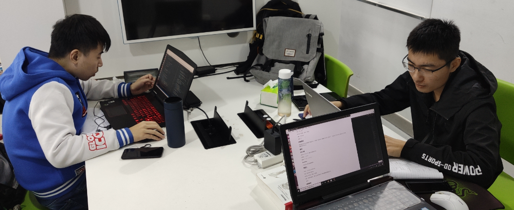
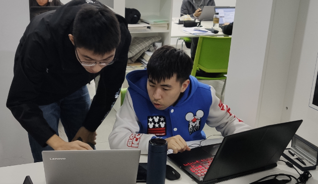
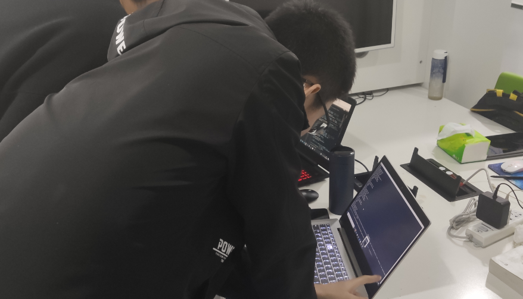
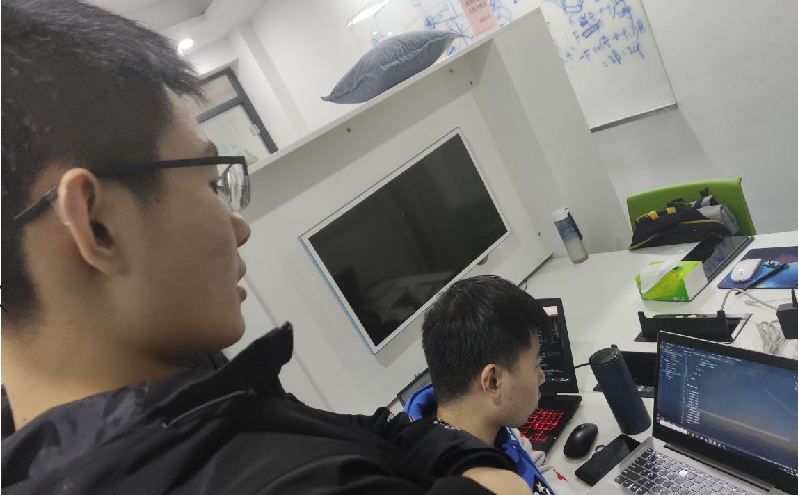

# 团队工作记录

记录团队的学习过程和讨论过程，

## 学习过程

描述队长如何安排成员进行学习工作，并描述完成情况

## 讨论1

时间：11月15日 11时到12时

地点：3A 一楼

参与者：缪立君、杨城、李晨昊

主题：任务分配

【图片】

### 过程描述

我们组在这次讨论中回顾了实验的目的，并理清了实验内容（即翻译C代码为 LLVM IR ），然后进行了任务分配，最后定下完成函数编写的Deadline。

### 结论

#### 任务分配

缪立君：6 7 8 9 10（数字为函数的次序）

李晨昊：1 2 3 4 5

杨城：11 12 13 14 15 16

#### Deadline

11月23号之前完成函数编写。

## 讨论2

时间： 11月22日 15时到23时

地点：图书馆101研讨室

参与者：缪立君、杨城、李晨昊

主题：阅读实验框架，熟悉 LLVM 结构以及了解助教编写的辅助文件。

【照片】

### 过程描述

我们组在这次讨论中各自阅读 cminus_builder.cpp 等代码，针对自己分配的任务部分，学习了解头文件中需要用到的类的声明及相关函数。理清代码框架及各个函数的调用关系。

### 结果

约定第二天完成代码部分，第三天 debug

## 讨论3

时间：11月23日 9时到12时	15时到23时

地点：图书馆101研讨室

参与者：缪立君、杨城、李晨昊

主题：各人编写各自的代码部分

【图片】

### 过程描述

三个人坐在一起，进行负责的代码编写工作并进行小规模 debug 。提出问题，大家讨论解决。并且尝试与其他组成员进行交流。

### 结果

初步完成实验代码，统一了全局变量的声明与定义，完成debug的前期准备工作。

## 讨论4

时间：11月24日 8时到12时	14时到23时

地点：图书馆102研讨室

参与者：缪立君、杨城、李晨昊

主题：正式开始 debug 工作，完成整个实验

【图片】

### 过程描述

由杨城和李晨昊进行框架的测试，缪立君独自完善对变量的定义和赋值语句的问题处理。在 debug 期间，杨城和李晨昊对于发现的变量声明和分支模块的跳转问题进行修改，并且自己编写 cminus 文件进行测试，发现了函数调用时参数传递问题和分支语句中出现返回语句时文件运行出错的问题，并积极寻找解决方法。其中解决了函数调用问题就解决了 input( ) 函数问题。与此同时，缪立君添加了数组处理和下标越界报错功能。

### 结果

完成实验和报告。