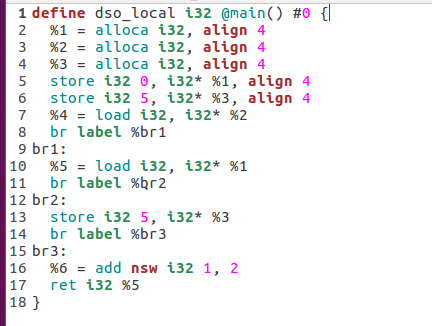
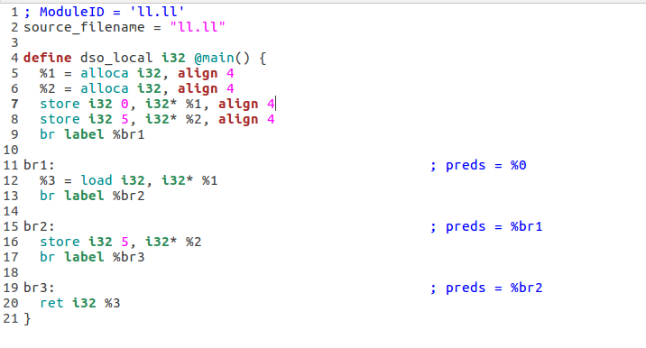
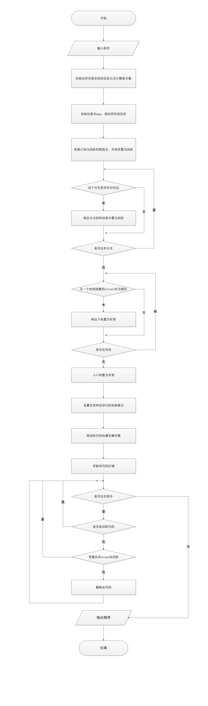

# lab3-2实验报告

| 小组成员 |  姓名  |    学号    |
| :------: | :----: | :--------: |
|   组长   |  杨城  | PB17111659 |
|   组员   | 缪立君 | PB17111635 |
|   组员   | 李晨昊 | PB17111658 |

## 实验要求

1. 阅读LLVM Pass的介绍，并学会使用`opt`工具
2. 从助教给出的两组可选Pass中各选一个，根据从LLVM官方文档中了解的相关信息和阅读相关源代码，完成任务

## 报告内容 

本小组选择了dce及adce，以下是对这两个pass的说明。

### dce

#### 任务1：

dce类型：Function Pass，作用：消除无效代码，重新检查已删除指令所使用的指令，以检查它们是否为新的无效指令。

#### 任务2：

手动构造了一个`.ll`文件，比较优化前后差异

```
define dso_local i32 @main() #0 {
  %1 = alloca i32, align 4
  %2 = alloca i32, align 4
  %3 = alloca i32, align 4
  store i32 0, i32* %1, align 4
  store i32 1, i32* %2, align 4
  store i32 5, i32* %3, align 4
  %4 = load i32, i32* %2
  br label %br1
br1:
  %5 = load i32, i32* %1
  br label %br2
  store i32 7, i32* %3
  br label %br3
br2:
  store i32 5, i32* %3
  br label %br3
  br label %br2
br3:
  ret i32 %5
}
```

以上是原始代码，可以看见`i32`类型寄存器`%4`并未在之后使用，则在优化代码中

```
; ModuleID = 'll.ll'
source_filename = "ll.ll"

define dso_local i32 @main() {
  %1 = alloca i32, align 4
  %2 = alloca i32, align 4
  %3 = alloca i32, align 4
  store i32 0, i32* %1, align 4
  store i32 1, i32* %2, align 4
  store i32 5, i32* %3, align 4
  br label %br1

br1:                                              ; preds = %0
  %4 = load i32, i32* %1
  br label %br2
                                                  ; No predecessors!
  store i32 7, i32* %3
  br label %br3

br2:                                              ; preds = %6, %br1
  store i32 5, i32* %3
  br label %br3
                                                  ; No predecessors!
  br label %br2

br3:                                              ; preds = %br2, %5
  ret i32 %4
}
```

之前所存在的寄存器`%4`代码已被删除。

​	除此之外，我们还用C语言、C-语言样例作为源码进行测试，但由于两种语言在生成LLVM中间代码时有严格的语法规定，**对变量的赋值都需要先声明后使用**，否则会得到报错信息。而凡是声明过的变量，在LLVM代码中均会被`alloca`，而被**预先分配空间的寄存器**不会被判定为死代码。

​	在上述样例中，还有一种死代码：**永远不会被执行的代码**，即上述代码的`br`无条件跳转指令后的代码，同样没有被删除，对应到C、C-中的`if(0){}`同样也不会在dce优化中被删除。

#### 任务3：
该Pass是以函数为单元进行处理。为了增加可读性，我将每个函数的功能写成流程图的形式。

1. 输入函数时，调用Pass开始检查

```flow
st=>start: 输入函数
cond1=>condition: 检测是否执行
st->cond1
op1=>operation: 取函数指令分析表TLI
op2=>operation: 结束程序
cond1(yes)->op1
cond1(no)->op2
op3=>operation: 开始删除死代码
op1->op3
sub1=>subroutine: eliminateDeadCode
op3->sub1
e=>end: 输出函数
sub1->e
```

2. eliminateDeadCode删除死指令后，又再次判断删除死指令的指令是否为死指令，达到删除无效代码的效果

   ```flow
   st=>start: 开始
   cond1=>condition: 是否还有指令
   op4=>operation: 取指令
   st->cond1
   cond1(yes)->op4
   cond2=>condition: 该指令是否已在WorkList中
   sub2=>subroutine: DCEInstruction
   op4->cond2
   cond2(yes)->op4
   cond2(no)->sub2
   sub2->cond1
   cond3=>condition: WorkList是否为空
   op5=>operation: 从WorkList取出指令
   sub3=>subroutine: DCEInstruction
   cond3(yes)->op5
   op5->sub3
   sub3->cond3
   cond1(no)->cond3
   e=>end: 结束
   cond3(no)->e
   ```

3. DCEInstruction中，通过将指令中每个操作数无效化，来检测其是否为死指令。

   ```flow
   st=>start: Start
   cond3=>condition: 根据TLI是否为死指令
   st->cond3
   cond4=>condition: DCE计数器是否为0
   op5=>operation: 不删除该指令
   cond3(no)->op5
   cond3(yes)->cond4
   cond4(yes)->op5
   op6=>operation: 取指令的操作数
   cond4(no)->op6
   op7=>operation: 使该操作数在指令中无效
   cond5=>condition: 该操作数被使用或指令的值为操作数的值
   cond5(yes)->op6
   op7->cond5
   op6->op7
   cond6=>condition: 该操作数无效化后是否成为无影响的指令
   op8=>operation: 在WorkList中加入该指令
   cond6(yes)->op8
   cond5(no)->cond6
   op9=>operation: 该指令在父母节点中删除
   op8->op9
   ```

### adce

#### 任务1：

adce Pass的类型：FunctionPass

adce Pass的作用：

1.首先默认所有指令是死的，之后再证明相关指令是否活跃，以此识别源IR中存在的死代码。

2.对于最终判定为不活跃的指令，作为死代码删除。

#### 任务2：

源IR：


LLVM IR：



优化部分：

- 源代码第3行删除：该处代码对变量进行声明，但之后并未对其赋值和使用，在adce Pass中未能证明其活跃，故视其为死代码予以删除。


- 源代码第7行删除：该行代码取值之后，没有对其进行引用，不影响结果，予以删除。


- 源代码第16行删除：类似1+2的无意义代码对结果不产生影响，作为死代码删除。

非优化部分：

- 对于“永远不会被执行的基本块”，激进的代码删除并不会将其视为死代码，因此不会被删除。

- 对于已声明已定值但未使用的变量，adce并不会将其视为死代码，因此也不会被删除。

#### 任务3：




## 实验总结

1. 了解了LLVM Pass，并学会了opt的使用。
2. 了解了两种死代码删除原理，并尝试使用案例进行优化，总结出几种优化的结果，了解了几种死代码的种类。
3. 熟悉了流程图的绘制。

## 实验反馈

无
