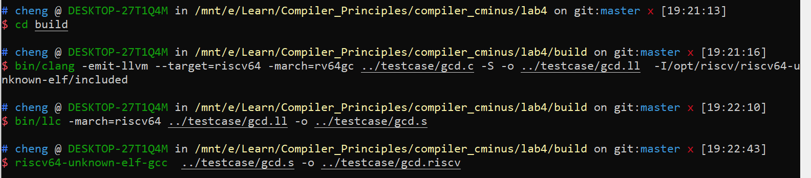
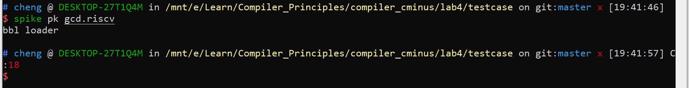
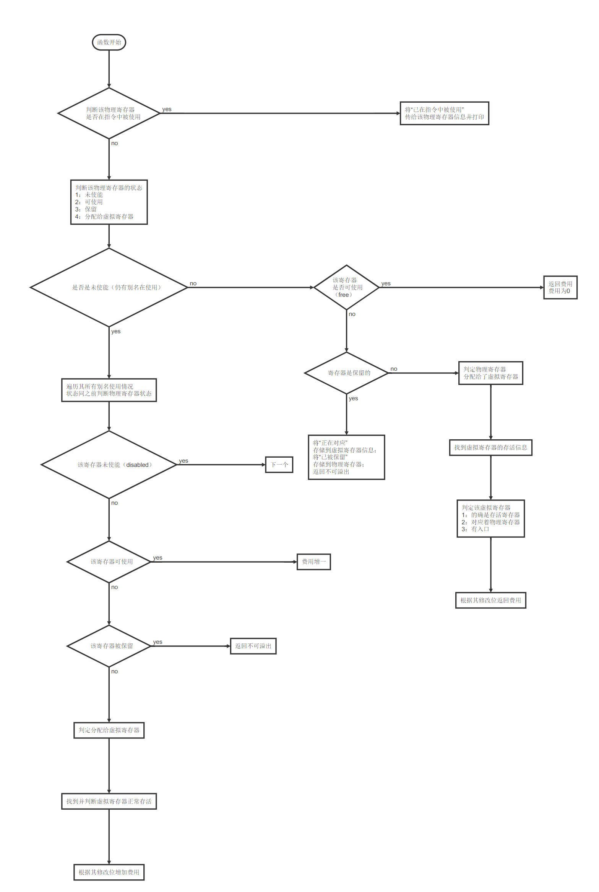

# lab4实验报告

| 小组成员 |  姓名  |    学号    |
| :------: | :----: | :--------: |
|   组长   |  杨城  | PB17111659 |
|   组员   | 缪立君 | PB17111635 |
|   组员   | 李晨昊 | PB17111658 |

## 实验要求

本次实验主要任务是：RISC-V 机器代码的生成和运行、LLVM源代码RegAllocFast.cpp的阅读与理解、寄存器分配的深入理解。

## 报告内容 

#### 1. RISC-V 机器代码的生成和运行

- LLVM 8.0.1适配RISC-V

    以下指令在lab4路径下执行：

    ```
  $ mkdir build
  $ cd build
  $ cmake -DLLVM_EXPERIMENTAL_TARGETS_TO_BUILD=RISCV -DLLVM_TARGETS_TO_BUILD=X86 /mnt/e/Compiler_Principles/llvm/llvm
  $ make -j2
  ```

    执行完毕后llvm支持RISC-V。

- lab3-0 GCD样例 LLVM IR 生成 RISC-V源码的过程

  gcd.c：

  ```c
  int gcd (int u, int v) { /* calculate the gcd of u and v */
    if (v == 0) return u;
    else return gcd(v, u - u / v * v); /* v,u-u/v*v is equals to u mod v*/
  }
  int main() {
    int x; int y; int temp;
    x = 72;
    y = 18;
    if (x<y) {
      temp = x;
      x = y;
      y = temp;
    }
    return gcd(x,y);
  }
  ```

  生成RISC-V源码：

  

  gcd.ll：

  ```
  ; ModuleID = '../testcase/gcd.c'
  source_filename = "../testcase/gcd.c"
  target datalayout = "e-m:e-p:64:64-i64:64-i128:128-n64-S128"
  target triple = "riscv64"
  
  ; Function Attrs: noinline nounwind optnone
  define dso_local signext i32 @gcd(i32 signext %u, i32 signext %v) #0 {
  entry:
    %retval = alloca i32, align 4
    %u.addr = alloca i32, align 4
    %v.addr = alloca i32, align 4
    store i32 %u, i32* %u.addr, align 4
    store i32 %v, i32* %v.addr, align 4
    %0 = load i32, i32* %v.addr, align 4
    %cmp = icmp eq i32 %0, 0
    br i1 %cmp, label %if.then, label %if.else
  
  if.then:                                          ; preds = %entry
    %1 = load i32, i32* %u.addr, align 4
    store i32 %1, i32* %retval, align 4
    br label %return
  
  if.else:                                          ; preds = %entry
    %2 = load i32, i32* %v.addr, align 4
    %3 = load i32, i32* %u.addr, align 4
    %4 = load i32, i32* %u.addr, align 4
    %5 = load i32, i32* %v.addr, align 4
    %div = sdiv i32 %4, %5
    %6 = load i32, i32* %v.addr, align 4
    %mul = mul nsw i32 %div, %6
    %sub = sub nsw i32 %3, %mul
    %call = call signext i32 @gcd(i32 signext %2, i32 signext %sub)
    store i32 %call, i32* %retval, align 4
    br label %return
  
  return:                                           ; preds = %if.else, %if.then
    %7 = load i32, i32* %retval, align 4
    ret i32 %7
  }
  
  ; Function Attrs: noinline nounwind optnone
  define dso_local signext i32 @main() #0 {
  entry:
    %retval = alloca i32, align 4
    %x = alloca i32, align 4
    %y = alloca i32, align 4
    %temp = alloca i32, align 4
    store i32 0, i32* %retval, align 4
    store i32 72, i32* %x, align 4
    store i32 18, i32* %y, align 4
    %0 = load i32, i32* %x, align 4
    %1 = load i32, i32* %y, align 4
    %cmp = icmp slt i32 %0, %1
    br i1 %cmp, label %if.then, label %if.end
  
  if.then:                                          ; preds = %entry
    %2 = load i32, i32* %x, align 4
    store i32 %2, i32* %temp, align 4
    %3 = load i32, i32* %y, align 4
    store i32 %3, i32* %x, align 4
    %4 = load i32, i32* %temp, align 4
    store i32 %4, i32* %y, align 4
    br label %if.end
  
  if.end:                                           ; preds = %if.then, %entry
    %5 = load i32, i32* %x, align 4
    %6 = load i32, i32* %y, align 4
    %call = call signext i32 @gcd(i32 signext %5, i32 signext %6)
    ret i32 %call
  }
  
  attributes #0 = { noinline nounwind optnone "correctly-rounded-divide-sqrt-fp-math"="false" "disable-tail-calls"="false" "less-precise-fpmad"="false" "min-legal-vector-width"="0" "no-frame-pointer-elim"="true" "no-frame-pointer-elim-non-leaf" "no-infs-fp-math"="false" "no-jump-tables"="false" "no-nans-fp-math"="false" "no-signed-zeros-fp-math"="false" "no-trapping-math"="false" "stack-protector-buffer-size"="8" "target-features"="+a,+c,+d,+f,+m" "unsafe-fp-math"="false" "use-soft-float"="false" }
  
  !llvm.module.flags = !{!0}
  !llvm.ident = !{!1}
  
  !0 = !{i32 1, !"wchar_size", i32 4}
  !1 = !{!"clang version 8.0.1 (tags/RELEASE_801/final)"}
  ```

  gcd.s：

  ```
  	.text
  	.file	"gcd.c"
  	.globl	gcd                     # -- Begin function gcd
  	.p2align	2
  	.type	gcd,@function
  gcd:                                    # @gcd
  # %bb.0:                                # %entry
  	addi	sp, sp, -48
  	sd	ra, 40(sp)
  	sd	s0, 32(sp)
  	sd	s1, 24(sp)
  	sd	s2, 16(sp)
  	addi	s0, sp, 48
  	sw	a0, -40(s0)
  	sw	a1, -44(s0)
  	lw	a0, -44(s0)
  	bnez	a0, .LBB0_2
  	j	.LBB0_1
  .LBB0_1:                                # %if.then
  	lw	a0, -40(s0)
  	sw	a0, -36(s0)
  	j	.LBB0_3
  .LBB0_2:                                # %if.else
  	lw	s2, -40(s0)
  	lw	s1, -44(s0)
  	mv	a0, s2
  	mv	a1, s1
  	call	__divdi3
  	mv	a1, s1
  	call	__muldi3
  	subw	a1, s2, a0
  	mv	a0, s1
  	call	gcd
  	sw	a0, -36(s0)
  	j	.LBB0_3
  .LBB0_3:                                # %return
  	lw	a0, -36(s0)
  	ld	s2, 16(sp)
  	ld	s1, 24(sp)
  	ld	s0, 32(sp)
  	ld	ra, 40(sp)
  	addi	sp, sp, 48
  	ret
  .Lfunc_end0:
  	.size	gcd, .Lfunc_end0-gcd
                                          # -- End function
  	.globl	main                    # -- Begin function main
  	.p2align	2
  	.type	main,@function
  main:                                   # @main
  # %bb.0:                                # %entry
  	addi	sp, sp, -32
  	sd	ra, 24(sp)
  	sd	s0, 16(sp)
  	addi	s0, sp, 32
  	sw	zero, -20(s0)
  	addi	a0, zero, 72
  	sw	a0, -24(s0)
  	addi	a0, zero, 18
  	sw	a0, -28(s0)
  	lw	a0, -24(s0)
  	lw	a1, -28(s0)
  	bge	a0, a1, .LBB1_2
  	j	.LBB1_1
  .LBB1_1:                                # %if.then
  	lw	a0, -24(s0)
  	sw	a0, -32(s0)
  	lw	a0, -28(s0)
  	sw	a0, -24(s0)
  	lw	a0, -32(s0)
  	sw	a0, -28(s0)
  	j	.LBB1_2
  .LBB1_2:                                # %if.end
  	lw	a0, -24(s0)
  	lw	a1, -28(s0)
  	call	gcd
  	ld	s0, 16(sp)
  	ld	ra, 24(sp)
  	addi	sp, sp, 32
  	ret
  .Lfunc_end1:
  	.size	main, .Lfunc_end1-main
                                          # -- End function
  
  	.ident	"clang version 8.0.1 (tags/RELEASE_801/final)"
  	.section	".note.GNU-stack","",@progbits
  ```

- 安装 Spike模拟器并运行上述生成的RISC-V源码

  在https://github.com/riscv/riscv-isa-sim/ 上下载riscv-isa-sim后，进入该路径执行以下指令
  
  ```
  $ sudo apt-get install device-tree-compiler
  $ mkdir build
  $ cd build
  $ ../configure --prefix=$RISCV
  $ sudo make
  $ sudo make install
  ```
  
  在https://github.com/riscv/riscv-pk 上下载riscv-pk后，进入该路径执行以下指令
  
  ```
  $ mkdir build
  $ cd build
  $ ../configure --prefix=$RISCV --host=riscv64-unknown-elf
  $ make
  $ sudo make install
  ```
  
  运行生成的gcd.riscv
  
  

#### 2. LLVM源码阅读与理解

- RegAllocFast.cpp 中的几个问题

  * RegAllocFast 函数的执行流程？

    ​		该类对一个函数进行寄存器选择和分配。在进行寄存器、指令、框架等一系列信息获取，得到块与块之间变量的传递，活跃变量等信息之后，开始逐块进行寄存器分配。

    ​		每一个块的寄存器在初始时都为空。每一个块的寄存器仅在该块执行时使用。在以块为单位处理寄存器时，需要考虑保留寄存器；调试所用寄存器不能影响代码生成时寄存器分配的情况，处理上述特殊情况后，开始逐条指令处理寄存器分配。在每个基本块执行完毕后，清空寄存器，将需要写回内存的变量从寄存器中写回。

    ​		在逐指令分配时，通过四次扫描，处理定义物理寄存器和虚拟寄存器的状态，并为虚拟寄存器找到合适的物理寄存器进行分配，而后清理死的虚拟寄存器。

    ​		找到合适物理寄存器时，通过计算分配时花费的代价，找到代价最小的分配方式，即为合适的物理寄存器分配方式。

  * *allocateInstruction* 函数有几次扫描过程以及每一次扫描的功能？

    答：共有三次扫描过程。

    第一次：将使用的 physreg 和早先 clobber 的 register 标记为已使用。找到 virtreg 操作数的结尾位置。

    第二次：分配使用的 virtreg 。追踪指令定义的 early clobbers 和 tied uses 的寄存器，将 defs 和tied uses 的 physreg 标记为已使用。在 call 之前将所有 virtreg 加入 spill slots 。

    第三次：分配 defs 。收集 dead defs 并在扫描之后杀死 dead defs。

  * *calcSpillCost* 函数的执行流程？

    答：该函数的作用是：对于一个物理寄存器，若其可以被分配，则返回清除该寄存器和该寄存器别名的溢出成本；若是未使能的，则返回不可溢出。

    下面用流程图的形式表示函数的执行流程。

    

  * *hasTiedOps*，*hasPartialRedefs，hasEarlyClobbers* 变量的作用？

    答：hasTiedOps: 指示是否存在 tied operand，作为判断条件的一部分。当操作数是一个 set 时 hasTiedOps 为 true。
    
    hasPartialRedefs: 指示当操作数是一个 use 时指令是否读取了 virtual register 。
    
    hasEarlyClobbers: 如果在读取所有输入寄存器之前，指令将此 MO_Register 'def' 操作数写入，则为 True 。这用于对 GCC 内联 asm '&' 约束修饰符建模。指示是否存在 early clobbers 。

- 书上所讲的算法与LLVM源码中的实现之间的不同点

1. 
   * 龙书中，一个寄存器中的变量在之后不再被使用时，则可以视作"free"地被新变量复用，而不计算代价。
   * 在LLVM源码中，一个寄存器地变量中在之后不再被使用，复用此寄存器地代价为其中不再使用地变量个数总和。（即spilldirty和spillclean的区别）。若需要被复用的寄存器中不再使用的变量有两个及以上，则代价超过了一个活跃变量寄存器被替换的代价。
   * 龙书中的算法偏向理论，而LLVM代码偏向实际，因为复用一个存储着不再使用变量的寄存器时，需要修改该变量的地址描述符，同样会产生一个代价。
2. 
   * 龙书中，不考虑寄存器别名的情况。
   * LLVM源码中，对于一个不可使能的寄存器，会根据其别名计算被重新分配时的代价
   * LLVM需要考虑实际机器寄存器的不同位宽可能正在作为不同寄存器使用的情况。
3. 
   * LLVM代码中，在寄存器分配时会优先判断推荐寄存器是否符合分配标准。
   * LLVM设置推荐寄存器，以便于在推荐寄存器能够使用时可以提高代码效率。
4. 
   * 龙书中，需要使用`LD`指令时，优先选择空寄存器。
   * LLVM源码中，优先选择一个存活寄存器（正在被使用的寄存器：HINT1）
   * 龙书作为理论理解更容易，而LLVM源码中，为了节约寄存器，优先考虑一个存活寄存器是否可以被复用。


## 组内讨论内容

#### 讨论时间

2019/12/19	上午8点半——下午11点

#### 参与人员

杨城	李晨昊	缪立君

#### 讨论内容

分工、环境配置及代码阅读

#### 讨论结果

由杨城完成RISC-V 机器代码的生成和运行，由李晨昊完成LLVM源码阅读的两个问题解答，由缪立君完成LLVM源码阅读的两个问题解答及书上与源码之间的实现不同点。

#### 图片记录


## 实验总结

1. 学会了如何配置LLVM使其支持RISC-V后端、学会了如何将C程序编译成RISC-V汇编代码及源码、学会了如何安装配置*Spike* RISC-V模拟器及运行RISC-V源码。
2. 深刻理解了LLVM源码中的RegAllocFast.cpp的实现方式，理解了工业界实现寄存器分配的技术。
3. 理清了书上的寄存器分配算法与实际实现之间的不同点，体会到了理论与实践之间的区别。

## 实验反馈

如果能提供更好的安装及配置教程，就更好啦！