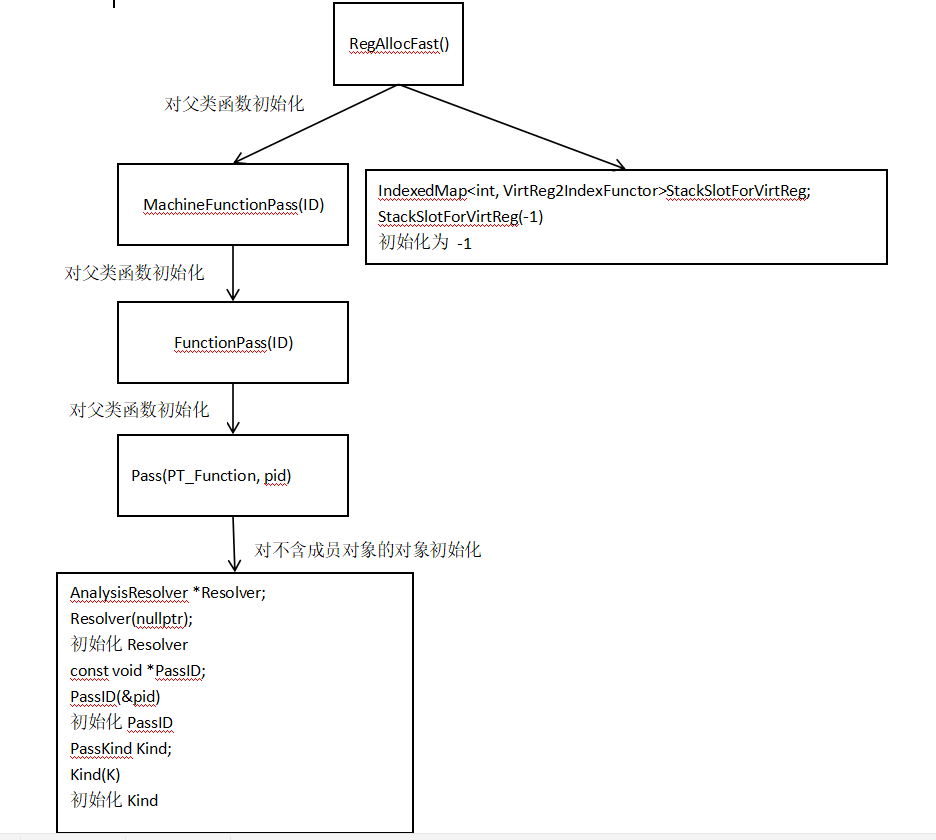

# lab4实验报告

组长 姓名 学号

小组成员 姓名 学号

## 实验要求

请按照自己的理解，写明本次实验需要干什么

## 报告内容 

#### 1. RISC-V 机器代码的生成和运行

- LLVM 8.0.1适配RISC-V

  ......

- lab3-0 GCD样例 LLVM IR 生成 RISC-V源码的过程

  ......

- 安装 Spike模拟器并运行上述生成的RISC-V源码

  ......

#### 2. LLVM源码阅读与理解

- RegAllocFast.cpp 中的几个问题

  * RegAllocFast* 函数的执行流程？

    答：

    

  * *allocateInstruction* 函数有几次扫描过程以及每一次扫描的功能？

    答：共有四次扫描过程。

    第一次：将使用的 physreg 和早先 clobber 的 register 标记为已使用。找到 virtreg 操作数的结尾位置。

    第二次：分配使用的 virtreg 。追踪指令定义的 early clobbers 和 tied uses 的寄存器，将 defs 和tied uses 的 physreg 标记为已使用。为未定义的操作数分配寄存器，在‘= op undef %X，%X’情形下，两个操作数赋值给同一个寄存器。在 call 之前将所有 virtreg 加入 spill slots 。

    第三次：在分配 virtreg defs之前将所有 physreg defs 标记为已使用。

    第四次：分配 defs 。收集 dead defs 并在扫描之后杀死 dead defs。

  * *calcSpillCost* 函数的执行流程？

    答：......

  * *hasTiedOps*，*hasPartialRedefs，hasEarlyClobbers* 变量的作用？

    答：hasTiedOps: 指示是否存在 tied operand，作为判断条件的一部分。当操作数是一个 set 时 hasTiedOps 为 true。
    
    hasPartialRedefs: 指示当操作数是一个 use 时指令是否读取了 virtual register 。
    
    hasEarlyClobbers: 如果在读取所有输入寄存器之前，指令将此 MO_Register 'def' 操作数写入，则为 True 。这用于对 GCC 内联 asm '&' 约束修饰符建模。指示是否存在 early clobbers 。

- 书上所讲的算法与LLVM源码中的实现之间的不同点

  ......

## 组内讨论内容

......

## 实验总结

此次实验有什么收获

## 实验反馈

对本次实验的建议（可选 不会评分）
